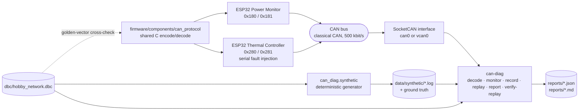

# CAN Diagnostic Analyzer

A CAN bus decoder and diagnostic analyzer for a two-node bench network, with the ESP-IDF firmware
for both nodes, the DBC that defines the bus, and a deterministic synthetic dataset so the whole
chain runs without hardware.

Raw CAN traffic is opaque, and the interesting failures on a cyclic bus are absences: a message
that stopped arriving, a heartbeat that timed out, a counter that jumped. This project decodes the
traffic into named engineering signals attributed to the transmitting node, watches for those
conditions, and writes a report in which every finding carries the evidence that produced it, the
expectation it was judged against, and an explicit statement of what the evidence cannot prove.

## What this project demonstrates

- DBC-driven decoding of CAN frames into scaled, named signals with units and node attribution.
- Recording and replaying timestamped sessions, including onto Linux virtual CAN.
- Reproducing an intermittent node-silence condition and detecting it as message and heartbeat
  timeouts localized to one node.
- Detecting out-of-range signal values and their recovery.
- Detecting sequence-counter gaps, including across the 255-to-0 wrap.
- Cross-checking the Python/DBC encoding against the shared C protocol implementation the firmware
  uses, so the two cannot drift apart silently.

## Architecture



The DBC is the single source of truth. No identifier, bit position or scale factor is hard-coded in
the Python package; the firmware carries the same constants in C, and a test compares the two on
every run.

## Messages and nodes

| CAN ID | Message | Sender | Period | Contents |
| --- | --- | --- | --- | --- |
| `0x180` | `POWER_DATA` | `PowerMonitor` | 100 ms | temperature, voltage, state, counter, fault code |
| `0x181` | `POWER_HEARTBEAT` | `PowerMonitor` | 1000 ms | uptime, state, reset reason |
| `0x280` | `THERMAL_DATA` | `ThermalController` | 100 ms | temperature, voltage, state, counter, fault code |
| `0x281` | `THERMAL_HEARTBEAT` | `ThermalController` | 1000 ms | uptime, state, reset reason |

Classical CAN, 500 kbit/s, standard 11-bit identifiers, 8-byte payloads. Temperature is a signed
little-endian value scaled by 0.1 degC; voltage is unsigned little-endian scaled by 0.01 V. The
project-defined plausibility ranges are -40.0 to 150.0 degC and 9.0 to 16.0 V. Full bit layout and
a worked decoding example are in [docs/protocol.md](docs/protocol.md).

## Fault scenarios

The Thermal Controller firmware accepts four serial commands. The synthetic generator reproduces
exactly those behaviours, so the captures, the ground truth and the firmware describe the same
thing. Intervals are half-open: `[start, end)`.

| Command | Injected behaviour | Findings produced |
| --- | --- | --- |
| `range 5` | Raw temperature `0x7FFF` with state `Degraded` and fault code `SensorSaturation` for 5 s. Counter and uptime keep running. | `range_violation`, `range_recovered` |
| `silent 3` | No `0x280` or `0x281` for 3 s. The node keeps running, so uptime continues and the counter resumes where it stopped. | `data_message_stale`, `heartbeat_timeout`, `node_silent`, `message_recovered`, `node_recovered` |
| `skip 4` | Counter advances 4 extra values before the next frame, leaving 4 values unobserved. | `sequence_gap` |
| `restart` | Controlled `esp_restart()`; returns with uptime 0, counter 0 and reset reason `Software`. | the silence findings plus `node_restart` |

`normal` clears an active condition. `silent` is application-level suppression: the firmware stops
calling `twai_transmit`. It does not create an electrical fault, and the reports do not claim it
does.

`data/synthetic/fault_session.log` carries `range 5`, `silent 3` and `skip 4`. The `restart`
command has its own capture, `data/synthetic/restart_session.log`, so the restart evidence can be
read on its own. `data/synthetic/normal_session.log` has no injected conditions and produces no
findings.

| Capture | Duration | Frames | Findings |
| --- | --- | --- | --- |
| `normal_session.log` | 10 s | 220 | none |
| `fault_session.log` | 60 s | 1287 | 9 |
| `restart_session.log` | 20 s | 418 | 7 |

## Quick start

Requires Python 3.11 or newer.

```bash
git clone https://github.com/Saitumu12/can-diagnostic-analyzer.git
cd can-diagnostic-analyzer
python -m venv .venv
source .venv/bin/activate        # Windows: .venv\Scripts\activate
pip install -e ".[dev]"
can-diag --version
```

## Generate data

One command regenerates every committed artifact: the three captures, their ground truth, and the
JSON and Markdown reports. Output is deterministic, so a clean checkout sees no file change after
running it. CI enforces that with `git diff --exit-code`.

```bash
python scripts/regenerate.py
```

## Decode and analyze

```bash
can-diag decode --dbc dbc/hobby_network.dbc --input data/synthetic/normal_session.log --limit 8
```

```text
t+   0.000  0x180  POWER_DATA         PowerMonitor       ModuleTemperature=30.9 degC, SupplyVoltage=12.41 V, NodeState=Normal, SequenceCounter=0, FaultCode=None, Reserved=0
t+   0.023  0x280  THERMAL_DATA       ThermalController  ModuleTemperature=24.5 degC, SupplyVoltage=12.36 V, NodeState=Normal, SequenceCounter=0, FaultCode=None, Reserved=0
```

Analyze a capture and write both report formats:

```bash
can-diag report --dbc dbc/hobby_network.dbc --input data/synthetic/fault_session.log \
    --json-output reports/fault_session.json \
    --markdown-output reports/fault_session.md
```

Watch a live interface instead:

```bash
can-diag monitor --dbc dbc/hobby_network.dbc --channel can0
```

Thresholds are configuration, not constants: override with `--data-stale-ms` and
`--heartbeat-stale-ms`, or with `--config file.json`. A 100 ms message is stale after 350 ms and a
1000 ms heartbeat after 2500 ms by default.

## Replay

```bash
scripts/setup_vcan.sh vcan0
can-diag replay --input data/synthetic/fault_session.log --channel vcan0
```

`replay` requires an explicit channel and refuses anything that does not start with `vcan` unless
`--allow-physical` is passed, so it cannot quietly inject frames into a live bench. `record` never
fabricates a capture: if no frames arrive it exits non-zero.

`verify-replay` compares an original capture with a recorded replay on frame count, identifier
order, payload equality, sequence continuity, finding classifications, and measured relative
timing. All timing figures are computed from the two captures at the moment you run it.

```bash
can-diag verify-replay --dbc dbc/hobby_network.dbc \
    --original data/synthetic/fault_session.log \
    --replayed /tmp/fault_session_vcan.log
```

A portable check that needs no SocketCAN, using the python-can in-process virtual backend:

```bash
python scripts/replay_check.py
```

## Run tests

```bash
pytest
ruff check .
ruff format --check .
```

The suite covers DBC layout and enumerations, the golden decoding vector, signed and scaled
decoding, range detection and recovery, freshness and heartbeat timeouts, node-level localization
with another node healthy, counter gaps and wraparound, restart handling, unknown identifiers,
empty and malformed captures, replay ordering and payload equality, timing statistics, report
generation, CLI exit codes, deterministic generation, agreement between ground truth and analyzer
output, and agreement between the DBC, the Python package and the C protocol implementation.

The C cross-check compiles `firmware/components/can_protocol` for the host with
`-Wall -Wextra -Werror -Wconversion -Wshadow -Wpedantic`, runs its vector program, and asserts that
every frame it produces decodes through the DBC to the same signals and that cantools re-encodes
the identical bytes. It skips when no C compiler is on `PATH`.

## Firmware build

Two ESP-IDF applications share one component that holds the protocol constants, the payload
encoders and decoders, and the TWAI bring-up. Plain C, no Arduino dependency.

```bash
. $IDF_PATH/export.sh

cd firmware/power_monitor
idf.py set-target esp32
idf.py build

cd ../thermal_controller
idf.py set-target esp32
idf.py build
```

TWAI TX is GPIO21 and RX is GPIO22, set through `CONFIG_CAN_BENCH_TWAI_TX_GPIO` and
`CONFIG_CAN_BENCH_TWAI_RX_GPIO` in `idf.py menuconfig` under **CAN bench node configuration**. CI
builds both applications against a pinned ESP-IDF release; see the workflow for the exact version.

## Linux vcan validation

```bash
scripts/vcan_roundtrip.sh vcan0 fault_session
```

The script loads `vcan`, brings up `vcan0`, records with `candump -L` from `can-utils` while
`can-diag replay` transmits, then runs `verify-replay` on the two captures and checks that the
analyzer's findings on the recorded capture match the scenario ground truth. It fails if any frame
is lost or any payload differs. CI runs the same script on an Ubuntu runner.

## Current validation status

| Capability | Status |
| --- | --- |
| DBC decoding | Verified by tests |
| Synthetic capture generation | Verified, deterministic and regenerated in CI |
| Analysis and reporting | Verified against ground truth |
| Python virtual replay | Verified by tests |
| Linux vcan replay | Verified by the CI integration job |
| Shared C protocol build and golden vectors | Verified with strict warnings as errors |
| Complete ESP-IDF firmware build | Verified by the CI build jobs |
| Firmware flashing | Not performed |
| Physical CAN bench | Not performed |
| Vehicle data | Not used |

The firmware compiles. It has not been flashed to an ESP32 and has not been run on hardware. No
capture in this repository came from a physical bus.

## Limitations

- The captures are deterministic synthetic traffic representing a small two-node test network.
  They are not vehicle data and were not recorded from hardware.
- A missing or stale message shows that expected traffic stopped reaching the analyzer and
  localizes the problem to one node or its communication path. It does not identify the physical
  cause, and cannot distinguish node firmware failure, power loss, wiring or connector failure,
  transceiver failure, a bus fault, or intentional transmission suppression.
- The DBC signal ranges are project-defined plausibility limits, not manufacturer specifications.
  An excursion means an implausible reported value, not a proven sensor defect.
- Replay reproduces application frames and approximate relative timing. It does not reproduce
  electrical behaviour, arbitration between real transmitters, acknowledgement, error frames, or
  bus-off transitions, and its inter-frame timing carries host scheduling error.
- A counter gap shows that counter values were never observed. It does not distinguish a
  transmitter that advanced its own counter from frames lost on the bus or dropped by the adapter.
- Narrowing any of this further needs evidence the frames do not carry: SocketCAN error counters
  and bus state, a scope on the differential pair, or a resistance measurement across the
  powered-off bus.

## Repository layout

```text
can-diagnostic-analyzer/
├── can_diag/            decoding, monitoring, recording, replay, reporting, scenario, generator
├── dbc/                 network definition
├── firmware/            ESP-IDF applications and the shared can_protocol component
├── data/synthetic/      deterministic captures and machine-readable ground truth
├── docs/                protocol, architecture, fault injection, replay, hardware design, notes
├── reports/            JSON and Markdown reports regenerated from the committed captures
├── scripts/             regeneration, replay checks, SocketCAN setup
└── tests/               test suite
```
